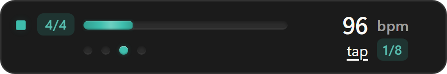
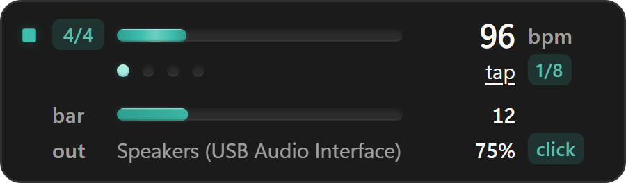
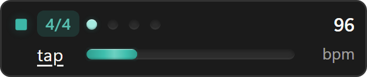
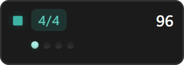

# TaktDock

A metronome that lives on the Windows taskbar. Pick a tempo and a meter, press
play, and keep playing without switching windows.

It runs as a small floating widget above the taskbar, or pinned into the
taskbar strip next to the clock. It never takes focus, so the DAW, the tab
viewer or the video you are playing along to keeps the keyboard.

> **Status:** not released yet. There is no installer on the releases page;
> build it from source as described below.



<sub>Floating placement. Play and the meter on the left, the tempo as a slider
and a number, the beats of the bar underneath with the one that just sounded
lit. The widget is translucent over whatever is behind it; these shots are
flattened so the corners stay clean on both GitHub themes.</sub>



<sub>Expanded. A sweep across each bar, and which output is playing, at what
volume, with which click.</sub>




<sub>Pinned, and pinned compact. Two rows sized to sit inside a 48 pixel
taskbar, and they still fit a 36 pixel one.</sub>

## Why

Practising with a metronome on a phone means a second screen to look at and a
device that goes to sleep. Practising with one in a browser tab means switching
to it to change the tempo, and a tab that is throttled the moment it is out of
sight. The tempo belongs where the clock is: always visible, one click away,
and never in the way.

## Features

- **Tempo from 30 to 300 bpm.** Scroll anywhere on the widget for one step,
  hold Shift for five, drag the slider, or tap the tempo in. Tap tempo averages
  the last four intervals and starts over after a two second pause. Presets
  from 60 to 180 are in the tray menu.
- **Meters** 1/4, 2/4, 3/4, 4/4, 5/4, 6/8 and 7/8, with the first beat accented
  (that can be turned off). Click the meter to step to the next one, right
  click it for the list.
- **Subdivisions:** none, eighths, triplets and sixteenths, quieter than the
  beat so the beat stays the beat.
- **Two clicks:** a short sine and a woodblock made of filtered noise, both
  rendered once when the stream opens. Volume follows a logarithmic curve, so
  every step of it is audible.
- **Sample accurate.** Clicks are counted in samples on the audio thread, never
  timed by the interface. A thousand beats in, a click is still on the sample
  it would be on if every interval had been exact. A new tempo takes the next
  interval, a new grid waits for the next beat and a new meter for the next
  bar, so nothing is ever cut off mid bar.
- **Pick the output.** System default, or any output device by name. If the
  chosen one disappears (the USB interface is unplugged, or a DAW holds it
  exclusively) TaktDock falls back to the default within two seconds, says so
  in the tray, and switches back by itself when the device returns.
- **Gets out of the way.** Hides while a fullscreen application is in front,
  including borderless games and fullscreen video. On more than one monitor it
  only hides for something that fills its own screen. **The sound never
  stops**: hiding is about the picture.
- **Two placements.** A floating window docked to the corner of the work area,
  or pinned into the taskbar left of the notification area. The monitor is
  remembered by identity, not coordinates, so unplugging a display or changing
  scaling cannot strand it off screen.
- **Follows the Windows theme** without a restart, and honours reduced motion.
- **Updates itself** when you say so, with a signed installer.

## Install

Once releases are published, one line in PowerShell:

```powershell
irm https://raw.githubusercontent.com/kalaylienes/taktdock/main/scripts/install.ps1 | iex
```

It downloads the latest installer from the releases page and runs it silently.
Per user install, no administrator prompt, fetches the WebView2 runtime if the
machine does not already have it. A portable zip will be on the releases page
as well.

Requirements: Windows 10 or 11.

The binary is not code signed, so Windows SmartScreen will warn on first run.
Choose **More info**, then **Run anyway**, or build it yourself from source and
judge the code directly.

### Updates

TaktDock asks GitHub once every six hours whether a newer release exists. When
there is one, a line appears at the top of the tray menu and stays there until
you click it. Nothing downloads or installs on its own.

Clicking it fetches the installer and checks it against a public key compiled
into the copy you are already running, so a release that was not signed with
the matching private key is refused rather than run. **Diagnostics → Check
automatically** turns the six hourly question off, and `taktdock.exe --update`
asks straight away and installs what it finds, through the same signed path.

## Using it

| Action | Result |
| --- | --- |
| Click ▶ | Play or stop |
| Scroll over the widget | Tempo up or down by one, by five with Shift |
| Drag the slider | Set the tempo |
| Click `tap` four times | Set the tempo from your taps |
| Click the meter or the grid | Step to the next one |
| Right click the meter or the grid | The list to pick from |
| Right click anywhere else | The full menu |
| Drag the left edge | Move the floating widget; the position is remembered |
| Left click the tray icon | Show or hide the widget |
| Middle click the tray icon | Play or stop, without showing anything |

From a script, a Stream Deck button or a key bound in another program:

```powershell
taktdock.exe --toggle     # play or stop the running copy
```

The tray icon is grey while stopped and turns the accent colour while playing.
Its tooltip reads the tempo, the meter, and anything wrong with the output.

Windows 11 hides new tray icons behind the overflow arrow by default. Drag it
onto the taskbar to keep it visible. If the widget is ever lost, running the
executable again brings it back rather than starting a second copy, and so does
`taktdock.exe --show`.

## Audio interfaces and exclusive mode

TaktDock plays through WASAPI in shared mode, the same way a browser or a
music player does. It does not use ASIO.

Most USB interfaces accept shared mode output alongside everything else, and
then the click simply plays through the interface into your headphones. When a
DAW opens the same interface through ASIO, many drivers hand it to the DAW
exclusively and nothing else can play through it until the DAW lets go. In that
case, either use the DAW's own click, or pick a second output for TaktDock
(the computer's speakers, or a separate pair of headphones). Some drivers,
RME and a number of Focusrite models among them, allow several clients at once,
and there both work together.

When the chosen output cannot be opened, TaktDock plays on the system default
instead, and the reason is shown in the tray menu and the tray tooltip.

## Platforms

| | Windows | Linux |
| --- | --- | --- |
| Metronome, all meters and grids | yes | builds and is tested in CI, no release yet |
| Output device choice and fallback | yes, WASAPI shared | ALSA, from the same code |
| Floating placement | yes | X11 yes, Wayland decides for itself |
| Pinned into the taskbar | yes | no, greyed out in the menu |
| Hiding for fullscreen apps | yes | X11 and XWayland |
| Start with the session | yes | yes |
| Updates itself | yes | AppImage only, once there is one |

Linux packages are planned for 1.1. The code already builds there, and CI
checks it on every push so it stays that way.

## Configuration

Everything in the menus is saved to `%APPDATA%\TaktDock\settings.json`. The
file can be edited by hand; a byte order mark from Notepad is fine. A few
things are only there:

| Key | Meaning |
| --- | --- |
| `widget.tray_gap` | Logical gap between the pinned strip and the notification area |
| `metronome.output_device` | Output by name, `null` for the system default |

`TAKTDOCK_DATA_DIR` moves the whole data directory, so a second build can run
beside an installed one without the two sharing settings. Run with `--demo` to
see the widget keep time with no sound device at all.

## Keeping it running

A metronome is something you open when you practise, so nothing keeps it
running by default. If you want it back whenever it stops, there is an
optional watchdog:

```powershell
powershell -ExecutionPolicy Bypass -File scripts/install-watchdog.ps1
```

It registers a scheduled task that starts TaktDock at sign in and checks once a
minute afterwards. The check is `taktdock.exe --watchdog`, never a script: a
scheduled task that starts a console program gets a real console window, and
where Windows Terminal is the default host that window shows itself whatever
`-WindowStyle` asks for. Once a minute it would flash in front of everything,
which is enough to drop a fullscreen game to the desktop.

Quitting from the tray menu is treated as deliberate and the watchdog leaves it
alone. To take the watchdog off again:

```powershell
powershell -ExecutionPolicy Bypass -File scripts/install-watchdog.ps1 -Remove
```

## When something goes wrong

- **Diagnostics → Save report** writes a summary next to the logs and opens the
  folder: the outputs found, which one is open, the sample rate, the slowest
  audio callback, dropouts reported by the driver, how far the device clock is
  from the system clock, memory and CPU time. `taktdock.exe --diagnose` asks the
  running copy for the same report without opening anything.
- If the app ever crashes, `last-crash.txt` in `%APPDATA%\TaktDock` names the
  thread and the place, with the last log lines. Attach it to an issue together
  with the report.
- If TaktDock closed while applying a setting that touches the window (pinning,
  click-through), the next start turns that one setting back off and tells you,
  instead of failing the same way again.

## Performance

Measured on a release build over a minute each, playing 120 bpm at 48 kHz on a
USB interface, with `--diagnose` for the audio figures:

| | Playing | Stopped |
| --- | --- | --- |
| CPU, share of one core | 0.6% | 0.1% |
| CPU, share of a 16 thread desktop | under 0.04% | under 0.01% |
| Resident memory | about 30 MB | about 24 MB |
| Slowest audio callback | 40 µs | |
| Dropouts reported by the driver | none | |

The audio callback copies precomputed samples and nothing else: no locks, no
allocation, no logging. The stream closes three seconds after stop, so an idle
TaktDock does not keep an interface awake. The beat animation runs on the
compositor and stops entirely while the widget is hidden or a game is in front.

## Building

Rust stable with the MSVC toolchain, Node.js 20 or later, Visual Studio Build
Tools with the C++ workload, and the WebView2 runtime.

```powershell
git clone https://github.com/kalaylienes/taktdock.git
cd taktdock
npm install
npm run app:dev      # run in development
npm run app:build    # installer in src-tauri/target/release/bundle
```

On Linux, the toolkit and ALSA development packages as well:

```bash
sudo apt install libwebkit2gtk-4.1-dev libgtk-3-dev libayatana-appindicator3-dev \
  librsvg2-dev libxdo-dev libasound2-dev patchelf
```

Tests:

```powershell
npm test             # interface tests through Playwright
npm run test:rust    # clock, sound, settings and placement unit tests
npm run docs:shots   # regenerates the images in this README

# Opens the real default output at volume zero and checks the timing on it
cargo test --manifest-path src-tauri/Cargo.toml --lib live_output -- --ignored --nocapture
```

## Architecture

| Layer | Stack | Responsibility |
| --- | --- | --- |
| Audio | Rust, cpal | Clock, click synthesis, output device, fallback |
| Shell | Rust, Tauri v2 | Window placement, tray, settings, updates |
| Interface | React and TypeScript | Drawing and input only; it keeps no time |

```
src/                    widget interface
src-tauri/src/
  audio/clock.rs        where the clicks go, counted in samples
  audio/voice.rs        what they sound like
  audio/engine.rs       the stream, the device and the beat events
  control.rs            every change to the metronome goes through here
  monitor.rs            monitor identity and taskbar geometry
  window.rs             placement, visibility, fullscreen, motion permission
  tray.rs               tray icon and menus
```

The sound is produced in Rust rather than with Web Audio in the webview. The
widget is hidden behind every fullscreen app, and a hidden page gets its timers
throttled; starting from the tray is not a user gesture, so the browser would
refuse to start audio; and listing output devices by name from a web page needs
microphone permission, which a metronome has no business asking for.

The widget is an ordinary top level window. It is never reparented into
`Shell_TrayWnd` and never registered as an appbar, even when pinned: pinned
placement only reads the strip's geometry. That lets it survive an Explorer
restart and keeps it from reserving desktop space.

## Scope

A practice metronome. Not a DAW click, not a rhythm trainer, not a setlist
manager, not a drum machine.

## License

GPL-3.0-or-later. See [LICENSE](LICENSE).
