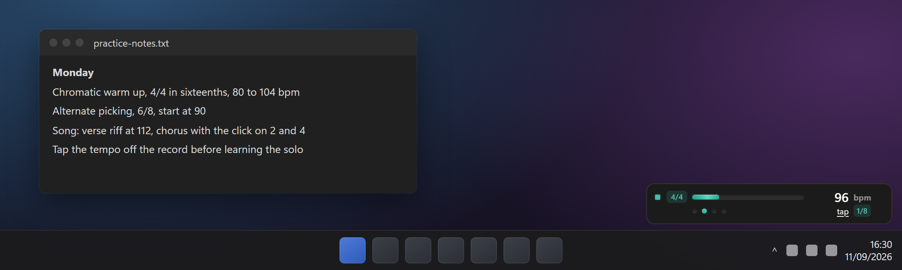
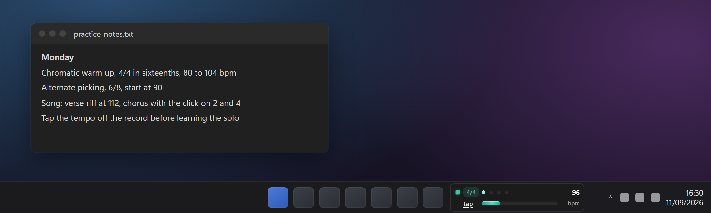
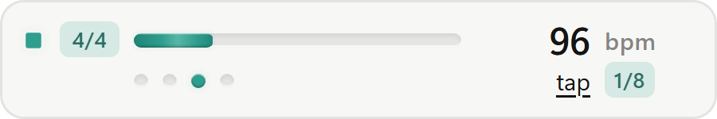
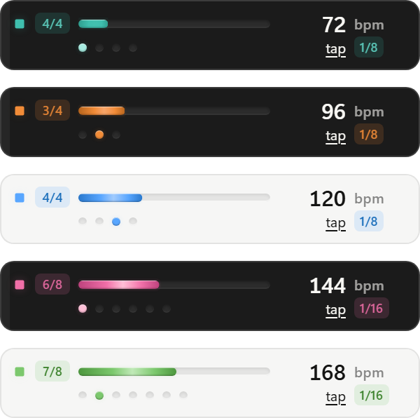
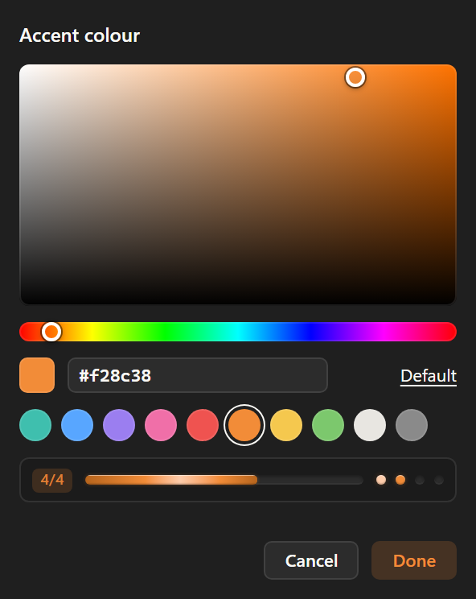

# TaktDock: a metronome for the Windows taskbar

**TaktDock is a free, open source metronome app for Windows 10 and 11 that
lives on the taskbar.** Pick a tempo and a time signature, press play, and keep
practising guitar, bass, drums, piano or voice without switching windows. It
floats just above the taskbar or pins right into it next to the clock, it never
steals keyboard focus from your DAW, tab viewer or video, and its click is
sample accurate.

[](LICENSE)
[](#install)
[](#architecture)
[](https://github.com/kalaylienes/taktdock/actions/workflows/ci.yml)
[](https://buymeacoffee.com/kalaylienes)



<sub>Floating above the taskbar. The desktop around it is an illustration; the
widget is the real interface.</sub>



<sub>Pinned into the taskbar strip, left of the notification area.</sub>

**[Download the latest release](https://github.com/kalaylienes/taktdock/releases/latest)**
or install it with one line of PowerShell, [below](#install).

## Contents

- [Why a taskbar metronome](#why-a-taskbar-metronome)
- [Features](#features)
- [Screenshots](#screenshots)
- [Install](#install)
- [Using it](#using-it)
- [Sounds](#sounds)
- [Accent colour](#accent-colour)
- [Audio interfaces, ASIO and exclusive mode](#audio-interfaces-asio-and-exclusive-mode)
- [Command line](#command-line)
- [Configuration](#configuration)
- [FAQ](#faq)
- [Performance](#performance)
- [Privacy](#privacy)
- [Architecture](#architecture)
- [Support the project](#support-the-project)
- [Credits](#credits)
- [License](#license)

## Why a taskbar metronome

A metronome on the phone is a second screen to look at and a device that goes
to sleep in the middle of a take. A metronome in a browser tab means switching
to it every time the tempo changes, and a tab stops keeping good time the
moment it is out of sight. A plugin in a DAW is overkill for twenty minutes of
scales.

The tempo belongs where the clock is: always visible, one click or one scroll
away, and never in front of the thing you are actually reading. TaktDock is
that and nothing more.

## Features

- **Tempo from 30 to 300 BPM.** Scroll anywhere on the widget for one step,
  hold Shift for five, drag the slider, or **tap tempo** with four clicks. Tap
  tempo averages the last four intervals and starts over after a two second
  pause. Presets from 60 to 180 BPM are in the tray menu.
- **Time signatures** 1/4, 2/4, 3/4, 4/4, 5/4, 6/8 and 7/8, with the first beat
  accented (you can turn the accent off). Click the meter to step to the next
  one, right click it for the whole list.
- **Subdivisions:** none, eighths, triplets and sixteenths. The clicks between
  beats play quieter, so the beat stays the beat.
- **Three sounds:** a classic click, a woodblock and a hi-hat, all synthesised
  in the app. [More below](#sounds).
- **Sample accurate timing.** Clicks are counted in audio samples on a real
  time audio thread, never timed by the interface. A thousand beats in, a click
  is still on the exact sample it should be on. A new tempo takes effect on the
  next click, a new subdivision on the next beat and a new meter on the next
  bar, so a bar is never cut off halfway.
- **Choose the output device.** System default, or any output by name: your USB
  audio interface, headphones, speakers. If the chosen device disappears (the
  interface is unplugged, or a DAW takes it over), TaktDock falls back to the
  default output within two seconds, tells you in the tray, and switches back
  on its own when the device returns.
- **Never steals focus.** Clicking the widget does not take the keyboard away
  from the window you are working in, and it does not show up in Alt+Tab.
- **Gets out of the way of games and videos.** It hides while a fullscreen app
  is in front, including borderless games and fullscreen video, and comes back
  when it closes. With more than one monitor it only hides for something that
  fills its own screen. **The sound never stops**; hiding is only about the
  picture.
- **Two placements.** A floating widget docked to the corner of the screen, or
  pinned into the taskbar left of the clock, in a normal or a compact size.
  Monitors are remembered by identity, not coordinates, so unplugging a display
  or changing the scaling cannot strand it off screen.
- **Any accent colour.** The turquoise is only the default; pick any colour you
  like from a colour square, type a hex value, or start from a preset. The
  tray icon follows.
- **Light and dark theme** following Windows automatically, or forced from the
  menu. Honours the reduced motion setting.
- **Updates itself** when you say so, with an installer signed by a key compiled
  into the app. Nothing is downloaded or installed without a click.
- **Light on the machine:** about 30 MB of memory and well under one percent of
  one CPU core while playing. [Measured figures](#performance).

## Screenshots

| Floating, dark | Floating, light |
| --- | --- |
|  |  |


<sub>Expanded: a sweep across each bar with its number, the output device that
is playing, the volume (scroll it) and the sound (click to switch).</sub>

| Pinned | Pinned, compact |
| --- | --- |
|  |  |

<sub>Both pinned sizes fit a standard 48 pixel Windows 11 taskbar and a small
36 pixel one.</sub>

| Any accent colour | The colour picker |
| --- | --- |
|  |  |

## Install

**Requirements:** Windows 10 or Windows 11, 64 bit. The WebView2 runtime that
ships with Windows 11 and current Windows 10 is used; the installer fetches it
if it is missing.

### From the releases page

The fastest way is one line in PowerShell:

```powershell
irm https://raw.githubusercontent.com/kalaylienes/taktdock/main/scripts/install.ps1 | iex
```

It downloads the latest installer from the
[releases page](https://github.com/kalaylienes/taktdock/releases) and runs it
silently. The install is per user, so there is no administrator prompt, and
TaktDock starts when it is done. You can also download
`TaktDock_x.y.z_x64-setup.exe` yourself and run it, or take the portable zip,
which is just `taktdock.exe`.

The app is not code signed yet, so Windows SmartScreen may warn the first time
you run it. Choose **More info**, then **Run anyway**, or build it yourself and
read the code first.

### Build it yourself

1. Install the tools once. In PowerShell:

   ```powershell
   winget install --id Git.Git -e
   winget install --id OpenJS.NodeJS.LTS -e
   winget install --id Rustlang.Rustup -e
   winget install --id Microsoft.VisualStudio.2022.BuildTools -e --override "--quiet --wait --add Microsoft.VisualStudio.Workload.VCTools --includeRecommended"
   ```

   Open a new terminal afterwards so the new tools are on the `PATH`.

2. Get the code and its dependencies:

   ```powershell
   git clone https://github.com/kalaylienes/taktdock.git
   cd taktdock
   npm install
   ```

3. Build the installer:

   ```powershell
   npm run app:build
   ```

   The first build compiles every Rust dependency and takes several minutes;
   later ones take one or two. The result is
   `src-tauri\target\release\bundle\nsis\TaktDock_1.0.0_x64-setup.exe`.
   No signing key is needed; only official releases carry a signed update
   package.

4. Run the installer. TaktDock is installed to
   `%LOCALAPPDATA%\TaktDock` and appears in the Start menu. Or skip the
   installer and run `src-tauri\target\release\taktdock.exe` directly.

To try it without installing anything, `npm run app:dev` starts it from the
source tree with live reload of the interface.

### After installing

- The widget appears in the bottom right corner, above the taskbar.
- Windows 11 hides new tray icons behind the **^** arrow. Drag the TaktDock icon
  onto the taskbar so it stays visible; it is the quickest way to the menu.
- To start TaktDock with Windows, turn on **Start with Windows** in the menu.

### Uninstall

**Settings → Apps → Installed apps → TaktDock → Uninstall**, or run
`%LOCALAPPDATA%\TaktDock\uninstall.exe`. Your settings stay in
`%APPDATA%\TaktDock`; delete that folder too to remove every trace.

## Using it

### The widget

| Action | Result |
| --- | --- |
| Click ▶ | Play or stop |
| Scroll over the widget | Tempo up or down by 1 BPM, by 5 with Shift held |
| Drag the slider | Set the tempo |
| Click `tap` four times or more | Set the tempo from your taps |
| Click the meter (`4/4`) | Next time signature |
| Click the grid (`1/8`) | Next subdivision |
| Right click the meter or the grid | The list to pick from, plus the accent switch |
| Right click anywhere else | The full menu |
| Drag the left edge | Move the floating widget; the position is remembered |

The dots under the slider are the beats of the bar. The one that just sounded
lights up, the downbeat in a brighter tone, and fades over the beat. The
animation is timed to when the click leaves the speaker, not to when it was
computed, so the light and the sound arrive together.

### The tray icon

| Action | Result |
| --- | --- |
| Left click | Show or hide the widget |
| Middle click | Play or stop without showing anything |
| Right click | The full menu |

The icon is grey while stopped and turns your accent colour while playing. Its
tooltip reads the tempo, the time signature, and anything wrong with the
output.

### The menu

| Entry | What it does |
| --- | --- |
| Start / Stop | Play or stop |
| Tempo | Presets: 60, 80, 100, 120, 140, 160, 180 BPM |
| Meter | Time signature, and whether the first beat is accented |
| Subdivision | None, eighths, triplets, sixteenths |
| Sound | Click, Wood, Hi-hat, and the volume |
| Output device | System default or any output; a problem with it is shown here |
| Show widget | Hide it and keep it playing, or bring it back |
| Placement | Floating, or pinned to the taskbar |
| Monitor | Which screen it sits on, and Reset position |
| Appearance | Accent colour, theme, Expanded, Compact, Animations, Click-through, Hide during fullscreen apps |
| Start with Windows | Start at sign in |
| Force restart | Restart the app cleanly |
| Open settings file | The JSON behind every setting |
| Diagnostics | Save a report, open the log folder, check for updates |
| Exit | Quit |

### Placement and sizes

- **Floating** (the default): 300 pixels wide, docked 12 pixels in from the
  right edge and 8 above the taskbar. Drag the left edge to move it anywhere;
  **Monitor → Reset position** puts it back. **Expanded** adds a bar sweep and
  the output row.
- **Pinned to the taskbar**: sits inside the taskbar strip, left of the
  notification area. **Compact** makes it narrower by dropping the slider row.
  TaktDock never becomes part of the taskbar itself; it only reads where the
  taskbar is, so restarting Explorer cannot break it and it reserves no space.
- A vertical taskbar has no room for the strip, so pinning falls back to
  floating there.

## Sounds

| Sound | On the downbeat | On the beat | Between beats |
| --- | --- | --- | --- |
| **Click** | 1500 Hz sine, 30 ms | 1000 Hz sine, 20 ms | the beat click, quieter |
| **Wood** | filtered noise around 3 kHz | around 2 kHz | the beat, quieter |
| **Hi-hat** | slightly open, 120 ms | closed, 45 ms | a short tick |

The accent on the downbeat is 3 dB louder than the beat, and clicks between
beats sit at 60 percent. Volume goes from 0 to 100 on a logarithmic curve
spanning 40 dB, so every step is audible: 50 is 25 dB below full, quiet but
clearly there, instead of a slider whose lower half does nothing. Every sound
is synthesised when the stream opens, so there is no sample library to
download and nothing to license.

## Accent colour

**Appearance → Accent colour...** opens the picker.

- Drag in the square for saturation and brightness, along the strip for the
  hue. The widget repaints as you drag and saves when you let go.
- Type a hex value such as `#f28c38` or `f80` and press Enter.
- Pick one of the presets.
- **Default** goes back to the original turquoise. **Cancel** or Escape puts
  back the colour the window opened with.

Any colour is allowed, black and white included. The chosen colour is used
exactly as picked; the darker end, the bright core and the glow of the bars
are derived from it, and the text on tinted pills is adjusted separately for
the light and dark themes so it always stays readable.

## Audio interfaces, ASIO and exclusive mode

TaktDock plays through **WASAPI in shared mode**, the same way a browser or a
music player does. It does not use ASIO.

Most USB audio interfaces (Focusrite Scarlett, M-Audio, Behringer, PreSonus and
others) accept shared mode output alongside everything else, and the click
simply plays through the interface into your headphones along with your
instrument.

When a DAW opens the same interface through **ASIO**, many drivers give it to
the DAW exclusively, and nothing else can play through the interface until the
DAW lets go. In that case you can:

- use the DAW's own metronome while recording, or
- choose a second output for TaktDock in **Output device**: the computer's
  speakers or a separate pair of headphones.

Some drivers, RME and a number of Focusrite models among them, allow several
clients at once, and then both work together. When the chosen output cannot be
opened, TaktDock plays on the system default instead and says why in the menu
and the tooltip.

Output latency is whatever Windows shared mode gives the device, typically
10 to 30 ms. It is constant, so it does not affect playing along; it only
matters if you try to line TaktDock up with another clock.

## Command line

The first four reach the copy that is already running, so they work from a
script, a hotkey tool such as AutoHotkey, or a Stream Deck button. When
nothing is running, they start TaktDock and then do the same.

| Command | Effect |
| --- | --- |
| `taktdock.exe --toggle` | Play or stop |
| `taktdock.exe --show` | Bring the widget back |
| `taktdock.exe --update` | Check for a new version and install it if there is one |
| `taktdock.exe --diagnose` | Write a diagnostic report to the data folder |
| `taktdock.exe --demo` | Start keeping time with no sound device at all, for trying the interface |

Running `taktdock.exe` a second time never starts a second copy; it brings the
widget back.

## Configuration

Everything in the menus is saved to `%APPDATA%\TaktDock\settings.json`. You can
edit it by hand while TaktDock is closed; a byte order mark from Notepad is
fine, and anything out of range is brought back into range.

| Key | Meaning |
| --- | --- |
| `metronome.bpm` | Tempo, 30 to 300 |
| `metronome.beats_per_bar`, `beat_unit` | Time signature |
| `metronome.subdivision` | 1, 2, 3 or 4 clicks per beat |
| `metronome.sound` | `click`, `wood` or `hihat` |
| `metronome.volume` | 0 to 100 |
| `metronome.output_device` | Output by name, `null` for the system default |
| `appearance.accent` | `#rrggbb`, or `null` for the default turquoise |
| `widget.tray_gap` | Gap between the pinned strip and the notification area, in pixels |

`TAKTDOCK_DATA_DIR` moves the whole data folder, so a second copy can run
beside an installed one without sharing settings.

### Keeping it running

A metronome is something you open when you practise, so nothing restarts it by
default. If you want it back whenever it stops, there is an optional watchdog:

```powershell
powershell -ExecutionPolicy Bypass -File scripts/install-watchdog.ps1
```

It registers a scheduled task that starts TaktDock at sign in and checks once a
minute afterwards. The task runs `taktdock.exe --watchdog` itself, never a
script, so it can never flash a console window over a fullscreen game. Quitting
from the menu is respected. Remove it with `-Remove`.

## FAQ

**Is TaktDock free?**
Yes. It is open source under the GPL, with no ads, no account and no
telemetry. If it helps your practice, you can
[buy me a coffee](https://buymeacoffee.com/kalaylienes).

**Does it work on Windows 10?**
Yes, Windows 10 and Windows 11, 64 bit.

**How accurate is the timing?**
The clicks are placed by counting samples on the audio thread, the same way a
DAW does, not with timers. The tests check that after a thousand beats at any
tempo from 30 to 300 BPM, at 44.1, 48 and 96 kHz, no click has moved by even
one sample.

**Can I use it with my audio interface while recording?**
Yes, as long as the interface accepts shared mode output while your DAW is
running. If your DAW holds it exclusively through ASIO, use the DAW's click or
give TaktDock another output. See [Audio interfaces](#audio-interfaces-asio-and-exclusive-mode).

**Will it interrupt my game or my video?**
No. It never takes focus, it hides while a fullscreen app fills its screen,
and it waits five seconds after the app closes before coming back, so it can
not pull a game out of fullscreen. The sound keeps playing throughout.

**Why can I not type into the widget?**
On purpose: a window that takes the keyboard would steal it from whatever you
are working in. Use the wheel, the slider, tap tempo or the menu. The accent
colour picker is a normal window and does take the keyboard.

**Does it have a keyboard shortcut?**
Not built in yet. Until it has, bind `taktdock.exe --toggle` to a key in
AutoHotkey, PowerToys or your keyboard software.

**Does it run on macOS or Linux?**
Not yet as a release. The code builds on Linux and CI checks it on every push;
Linux packages are planned for version 1.1. macOS is not planned.

**Where are the logs?**
`%APPDATA%\TaktDock\logs`. **Diagnostics → Save report** puts everything useful
for a bug report in one file next to them. If the app ever crashes,
`last-crash.txt` in the same folder names the place and the thread.

## Performance

Measured on a release build over a minute each, playing 120 BPM at 48 kHz on a
USB interface, with `--diagnose` for the audio figures:

| | Playing | Stopped |
| --- | --- | --- |
| CPU, share of one core | 0.6% | 0.1% |
| CPU, share of a 16 thread desktop | under 0.04% | under 0.01% |
| Resident memory | about 30 MB | about 24 MB |
| Slowest audio callback | 40 µs | |
| Dropouts reported by the driver | none | |
| Installer size | 2.4 MB | |

The audio callback copies prepared samples and nothing else: no locks, no
memory allocation, no logging. The stream closes three seconds after stop, so
an idle TaktDock does not keep an interface awake. The beat animation runs on
the compositor and stops while the widget is hidden or a game is in front.

## Privacy

- No account, no analytics, no telemetry.
- The only network request is the update check to GitHub, once every six hours,
  which you can turn off in **Diagnostics → Check automatically**.
- Settings and logs stay in `%APPDATA%\TaktDock`.
- TaktDock reads window positions to know when something is fullscreen. It does
  not read other programs' memory, inject anything or hook any graphics API, so
  it is safe alongside anti cheat.

## Architecture

| Layer | Stack | Responsibility |
| --- | --- | --- |
| Audio | Rust, cpal, WASAPI | Sample clock, sounds, output device, fallback |
| Shell | Rust, Tauri 2 | Window placement, tray, settings, updates |
| Interface | React, TypeScript | Drawing and input only; it keeps no time |

```
src/                    widget interface and the colour picker
src-tauri/src/
  audio/clock.rs        where the clicks go, counted in samples
  audio/voice.rs        what they sound like
  audio/engine.rs       the stream, the device and the beat events
  control.rs            every change to the metronome goes through here
  monitor.rs            monitor identity and taskbar geometry
  window.rs             placement, visibility, fullscreen, motion permission
  tray.rs               tray icon and menus
```

The sound is made in Rust rather than with Web Audio in the webview, for three
reasons. The widget is hidden behind every fullscreen app, and a hidden page
has its timers throttled. Starting from the tray is not a user gesture, so a
browser would refuse to start audio. And listing output devices by name from a
web page needs microphone permission, which a metronome has no business asking
for.

Tests:

```powershell
npm test             # interface tests through Playwright
npm run test:rust    # clock, sound, settings and placement unit tests
npm run docs:shots   # regenerates the images in this README

# Opens the real default output at volume zero and checks the timing on it
cargo test --manifest-path src-tauri/Cargo.toml --lib live_output -- --ignored --nocapture
```

To build on Linux, install the toolkit and ALSA development packages first:

```bash
sudo apt install libwebkit2gtk-4.1-dev libgtk-3-dev libayatana-appindicator3-dev \
  librsvg2-dev libxdo-dev libasound2-dev patchelf
```

## Support the project

TaktDock is free and stays free. If it keeps you in time, you can support its
development here:

[](https://buymeacoffee.com/kalaylienes)

Bug reports and ideas are welcome in
[issues](https://github.com/kalaylienes/taktdock/issues). A star helps other
musicians find it.

## Credits

- The window placement, fullscreen detection and tray skeleton come from
  [FluxDock](https://github.com/kalaylienes/fluxdock), a usage widget by the same
  author.

## License

GPL-3.0-or-later. See [LICENSE](LICENSE).
